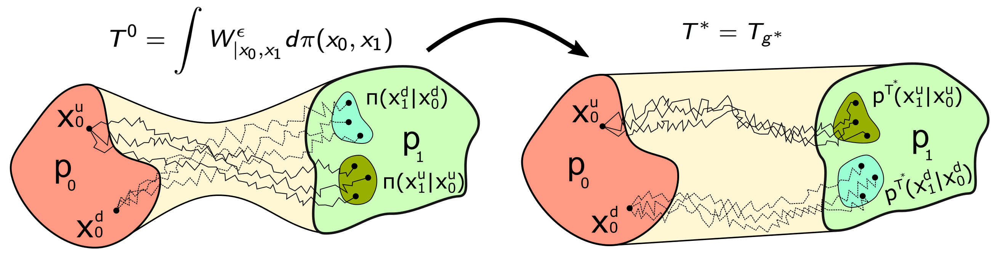

# Light and Optimal Schrödinger Bridge Matching

This is the official PyTorch implementation of our [ICML 2024](https://icml.cc/) paper [Light and Optimal Schrödinger Bridge Matching](https://arxiv.org/abs/2402.03207) by [Nikita Gushchin](https://scholar.google.ru/citations?user=UaRTbNoAAAAJ&hl=en&oi=sra), Sergei Kholkin, [Evgeny Burnaev](https://scholar.google.ru/citations?user=pCRdcOwAAAAJ&hl=ru), [Alexander Korotin](https://scholar.google.ru/citations?hl=en&user=1rIIvjAAAAAJ&view_op=list_works&sortby=pubdate). Our proposed light solver provably recovers the Schrödinger Bridge in just one Markovian Projection (Bridge Matching) iteration starting from any initial transport plan (independent, minibatch, etc.).



**An example:** Unpaired *Adult* -> *Child* translation by out LightSB-M solver applied in the latent space of ALAE for 1024x1024 FFHQ images.


## Installation

python=3.10

Install project requirements

```pip install -r requirements.txt```

For Entropic Optimal Transport Benchmark (EOTBench) experiments install it from [link](https://github.com/ngushchin/EntropicOTBenchmark/) (see their instructions)

For ALAE experiments install ALAE requirements

```pip install -r ALAE/requirements.txt```

## Repository structure:

```ALAE``` - Code for the ALAE model.

```src``` - LightSBM implementation with discrete optimal transport.

```notebooks``` - Jupyter notebooks with experiments for LightSBM.

### LightSB-M

```notebooks/LightSBM_EOT.ipynb``` - code for EOT Benchmark problems.

```notebooks/LightSBM_MSCI.ipynb``` - code for single cell data analysis problems.

```notebooks/LightSBM_swiss_roll.ipynb``` - code for Swiss Roll experiments.

```notebooks/LightSBM_ALAE.ipynb``` - Code for image experiments with ALAE.

### HardSB-M

```notebooks/HardSBM_swiss_roll.ipynb``` - code for Swiss Roll experiments with both MC and MCMC samplers

## Citation
 
```
@inproceedings{gushchin2024light,
  title={Light and Optimal Schr{\"o}dinger Bridge Matching},
  author={Gushchin, Nikita and Kholkin, Sergei and Burnaev, Evgeny and Korotin, Alexander},
  booktitle={Forty-first International Conference on Machine Learning},
  year={2024}
}
```
